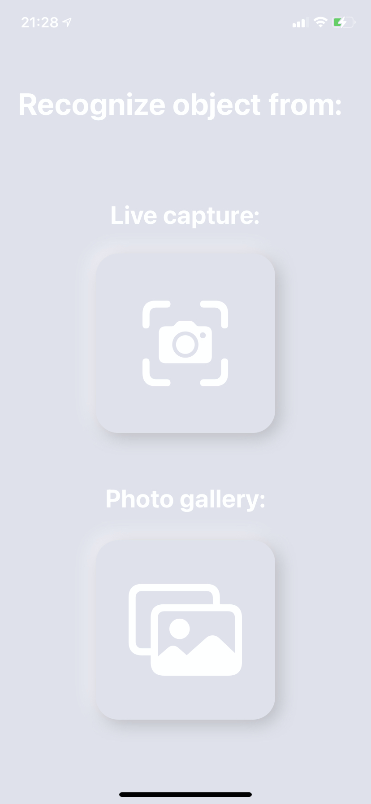
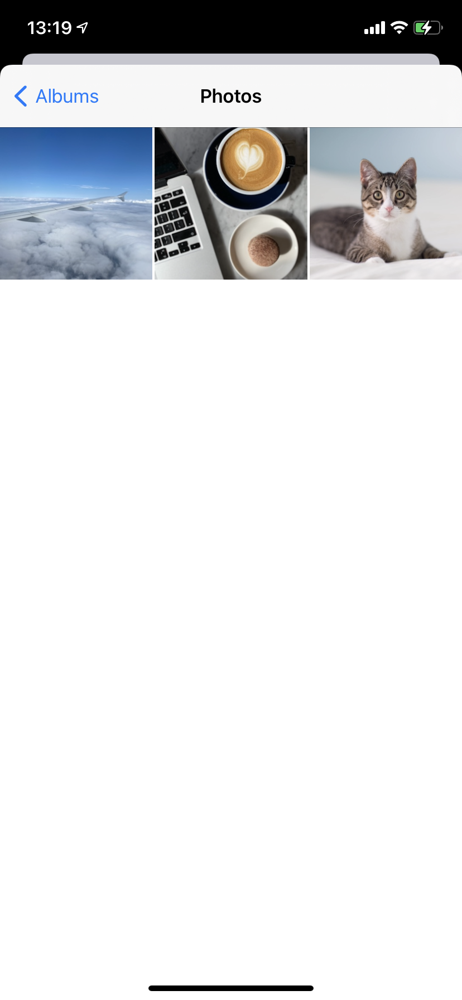
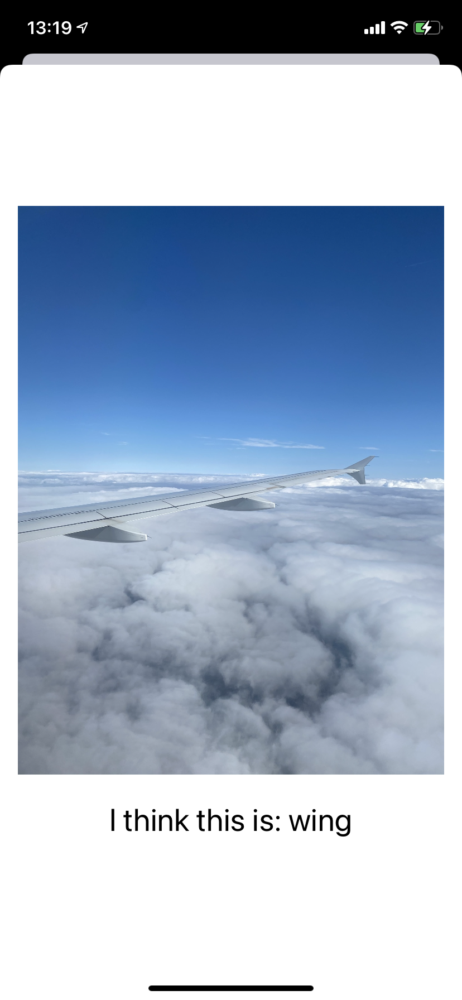

# ObjectDetection-CoreML-Vision

>In this project Im using CoreML and Vision to detect object from photos imported form photo gallery or live capture using iPhone camera. 

- In first case We choose photo with ImagePicker(To integrate UIKit and SwiftUI im using UIViewRepresentable) 
- CoreML proccesing it and returns array with detected objects and confidence. 
- In the second case the Vision framework can recognize objects in live capture.
- Vision requests made with a Core ML model return results as VNRecognizedObjectObservation objects, which identify objects found in the captured scene and also returning it coordinates.

## Setup
```swift
private lazy var classificationRequest: VNCoreMLRequest = {
        do {
            let model = try VNCoreMLModel(for: SqueezeNet().model)
            let request = VNCoreMLRequest(model: model) { [weak self] request, error in
                guard let self = self else {
                    return
                }
                self.processClassifications(for: request, error: error)
            }
            request.imageCropAndScaleOption = .centerCrop
            return request
        } catch {
            fatalError("Failed to load Vision ML model: \(error)")
        }
    }()
```
## Run request
```swift
func classifyImage(_ image: UIImage) {
        guard let orientation = CGImagePropertyOrientation(
                rawValue: UInt32(image.imageOrientation.rawValue)) else {
            return
        }
        
        guard let ciImage = CIImage(image: image) else {
            fatalError("Unable to create \(CIImage.self) from \(image).")
        }
        DispatchQueue.global(qos: .userInitiated).async {
            let handler =
                VNImageRequestHandler(ciImage: ciImage, orientation: orientation)
            do {
                try handler.perform([self.classificationRequest])
                self.classifiedImage = Image(uiImage: image)
            } catch {
                print("Failed to perform classification.\n\(error.localizedDescription)")
            }
       }
    }
````

##
<h3>Screenshots</h3>
<p align="center">
  
  
  
  
 </p>
